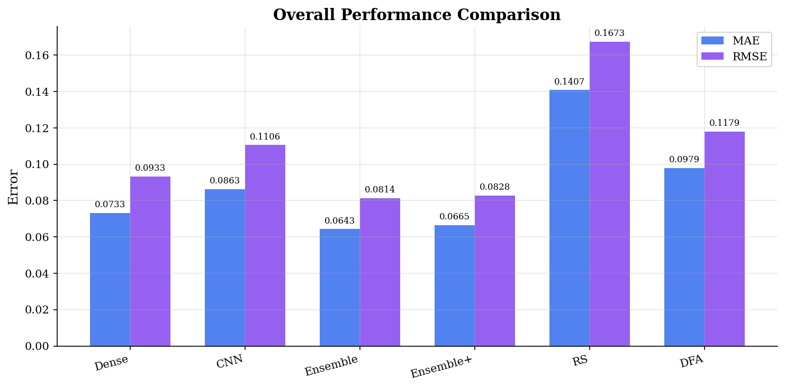
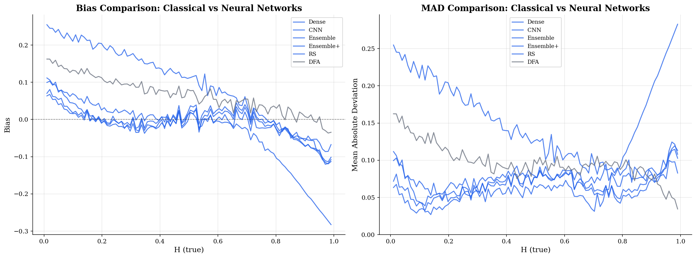

# Study Guide: Deep Learning for Hurst Exponent Estimation

A complete reference for all the concepts, formulas, decisions, and results in this project. Come back here whenever you need to refresh your understanding.

---

## Table of Contents

1. [Core Concepts](#1-core-concepts)
   - [What is a Time Series?](#11-what-is-a-time-series)
   - [What is Memory in a Time Series?](#12-what-is-memory-in-a-time-series)
   - [The Hurst Exponent H](#13-the-hurst-exponent-h)
   - [Brownian Motion vs Fractional Brownian Motion](#14-brownian-motion-vs-fractional-brownian-motion)
2. [Mathematical Foundations](#2-mathematical-foundations)
   - [fBM Definition and Covariance](#21-fbm-definition-and-covariance)
   - [Classical Methods to Estimate H](#22-classical-methods-to-estimate-h)
3. [Part 1: Synthetic Data](#3-part-1-synthetic-data)
   - [What We Generated and Why](#31-what-we-generated-and-why)
   - [Rescaling: What, How, and Why](#32-rescaling-what-how-and-why)
   - [Train/Val/Test Split](#33-trainvaltest-split)
   - [Data Persistence](#34-data-persistence)
4. [Figure-by-Figure Explanations](#4-figure-by-figure-explanations)
5. [Part 2: Dense Network](#5-part-2-dense-network)
6. [Part 3: CNN](#6-part-3-cnn)
7. [Part 4: Ensemble (Dense + CNN)](#7-part-4-ensemble-dense--cnn)
8. [Part 5: Real Data & Trading](#8-part-5-real-data--trading)
9. [Key Questions & Answers](#9-key-questions--answers)
10. [References](#10-references)

---

## 1. Core Concepts

### 1.1 What is a Time Series?

A time series is simply **an ordered sequence of numbers measured over time**. Examples:

- Daily stock prices: `[100, 102, 99, 101, 103, ...]`
- Hourly temperature: `[21.5, 22.0, 22.3, 21.8, ...]`
- Your heart rate every second: `[72, 73, 71, 74, ...]`

In this project, each time series is **100 numbers long**, and each number represents a **price increment** (how much the price changed at that time step):

```
Sample: [0.02, -0.05, 0.03, 0.01, -0.08, 0.04, ...]   (100 values)

Meaning:
  t=1: price went UP by 0.02
  t=2: price went DOWN by 0.05
  t=3: price went UP by 0.03
  ...
```

If you **add up** (cumulate) the increments, you get the actual price trajectory.

### 1.2 What is Memory in a Time Series?

Memory means: **does knowing past values help predict future values?**

Imagine a stock went up 3 days in a row:

- **If it tends to keep going up** after that → the series has **positive memory** (trending/persistent)
- **If it tends to reverse and go down** → the series has **negative memory** (mean-reverting/anti-persistent)
- **If it's a coin flip either way** → the series has **no memory** (random walk)

Memory is not binary. It's a **spectrum**, and the Hurst exponent is the number that measures where on that spectrum a time series falls.

### 1.3 The Hurst Exponent H

H is a single number between 0 and 1:

| H value | Name | Behavior | Financial intuition |
|---------|------|----------|---------------------|
| **0 < H < 0.5** | Anti-persistent | Mean-reverting | Price bounces between levels. After going up, it tends to go down. |
| **H = 0.5** | No memory | Random walk | Past tells you nothing. This is what standard finance theory (EMH) assumes. |
| **0.5 < H < 1** | Persistent | Trending | Momentum exists. After going up, it tends to keep going up. |

The closer H is to 0 or 1, the stronger the effect. H = 0.5 is the dividing line where there's no exploitable pattern.

**Why it matters for trading**: If you can estimate H from real market data and it's significantly different from 0.5, you have a signal:
- H > 0.5 → use a **momentum** strategy (follow the trend)
- H < 0.5 → use a **mean-reversion** strategy (bet on reversal)

### 1.4 Brownian Motion vs Fractional Brownian Motion

**Brownian Motion (BM)** is the mathematical model of a random walk. Its increments are **independent** — each step has no relationship to the previous step. BM always has H = 0.5.

**Fractional Brownian Motion (fBM)** generalizes BM by introducing **correlated increments**. The parameter that controls the correlation is H:

```
BM  (H=0.5):  step_1 is independent of step_2 is independent of step_3 ...
fBM (H=0.8):  step_1 is positively correlated with step_2, step_3, ...
fBM (H=0.2):  step_1 is negatively correlated with step_2, step_3, ...
```

When H = 0.5, fBM reduces to regular BM — so BM is just a special case.

**Why we use fBM in this project**: We need labeled training data (time_series, true_H). With fBM, we **choose** H, generate the series, and know the ground truth. It's our synthetic data factory.

---

## 2. Mathematical Foundations

### 2.1 fBM Definition and Covariance

A fractional Brownian motion `B_H(t)` with Hurst parameter H is a Gaussian process with:

- **Mean**: `E[B_H(t)] = 0`
- **Covariance**:

```
Cov(B_H(t), B_H(s)) = (1/2) * (|t|^(2H) + |s|^(2H) - |t-s|^(2H))
```

For the **increments** (what we actually work with), `X_k = B_H(k+1) - B_H(k)`:

- **Variance**: `Var(X_k) = 1` (for unit-time increments of standard fBM)
- **Autocovariance at lag n**:

```
gamma(n) = (1/2) * (|n+1|^(2H) - 2|n|^(2H) + |n-1|^(2H))
```

Key observations from this formula:
- When **H = 0.5**: `gamma(n) = 0` for all `n >= 1` → increments are **uncorrelated** (standard BM)
- When **H > 0.5**: `gamma(n) > 0` → increments are **positively correlated** (trending)
- When **H < 0.5**: `gamma(n) < 0` → increments are **negatively correlated** (mean-reverting)

The autocovariance decays as a **power law**: `gamma(n) ~ H(2H-1) * n^(2H-2)` for large n.

This means:
- For H > 0.5, the sum of autocovariances **diverges** → "long memory"
- For H < 0.5, autocovariances are summable → "short memory" (anti-persistent)

### 2.2 Classical Methods to Estimate H

Before neural networks, these methods were used:

**R/S (Rescaled Range) Analysis** — the original method by Hurst (1951):

1. Take a time series of length n
2. Split into blocks of size k
3. For each block:
   - Compute cumulative deviations from the block mean
   - R = max(cumulative deviations) - min(cumulative deviations)
   - S = standard deviation of the block
4. Average R/S across blocks
5. Repeat for many values of k
6. Plot log(R/S) vs log(k) → **the slope is H**

The scaling law is:

```
E[R/S] ~ C * n^H    as n → infinity
```

**DFA (Detrended Fluctuation Analysis)**:

1. Compute cumulative sum of the series
2. Divide into windows of size n
3. In each window, fit a polynomial trend and compute the residual fluctuation F(n)
4. Plot log(F(n)) vs log(n) → **the slope is H**

**Variogram method**:

```
V(lag) = E[(X(t+lag) - X(t))^2] ~ lag^(2H)
```

Plot log(V) vs log(lag) → slope/2 = H.

**Whittle MLE**: Maximum likelihood estimation in the frequency domain. Most statistically efficient but computationally heavier.

**Why neural networks?** All these methods:
- Need long series (hundreds of points minimum) for reliable estimates
- Are sensitive to short-range correlations
- Give noisy estimates for short series (like T=100)

A trained neural network can potentially give **better estimates from shorter series** because it learns the full joint distribution, not just a single scaling relationship.

---

## 3. Part 1: Synthetic Data

### 3.1 What We Generated and Why

**What**: 21,000 fBM time series, each of length T = 100.

**How**:
- Pick 100 values of H equally spaced in [0.01, 0.99]
- For each H, generate 210 independent fBM paths using the **Davies-Harte algorithm** (an exact simulation method based on circulant embedding of the covariance matrix)
- Store the **increments** (differences), not the cumulative paths
- Total: 100 x 210 = 21,000 samples

**The dataset looks like this**:

```
X = numpy array, shape (21000, 100)    ← 21000 rows, each is 100 increments
y = numpy array, shape (21000,)        ← the true H for each row

Example rows:
X[0]     = [0.52, -0.61, 0.48, ...]    y[0]   = 0.01  (very mean-reverting)
X[1]     = [-0.43, 0.55, -0.39, ...]   y[1]   = 0.01
...
X[209]   = [0.31, -0.47, 0.52, ...]    y[209] = 0.01
X[210]   = [0.18, -0.22, 0.15, ...]    y[210] = 0.02  (next H value)
...
X[20999] = [0.001, 0.002, 0.001, ...]  y[20999] = 0.99  (very trending)
```

**Why fBM?** Because we need **(input, label)** pairs to train a neural network:
- **Input**: a time series (100 numbers)
- **Label**: the true H

With real financial data, we don't know the true H. With fBM, we choose H, so we have perfect labels. The assumption is that what the network learns from fBM generalizes to real data.

**Why increments instead of cumulative paths?** In finance, we work with **returns** (price changes), not raw prices. fBM increments correspond to returns. Also, increments are **stationary** (their statistical properties don't change over time), while cumulative paths are not.

### 3.2 Rescaling: What, How, and Why

**The problem**: The variance of fBM increments depends on H.

```
H = 0.1  →  increments are BIG numbers    (std ≈ 0.5)
H = 0.5  →  increments are MEDIUM numbers (std ≈ 0.1)
H = 0.9  →  increments are TINY numbers   (std ≈ 0.005)
```

A lazy network could just compute `std(sample)` and read off H without learning anything about memory or correlations. This is the **cheat**.

**The solution — per-sample standardization**:

For each sample individually:

```
X_rescaled[i] = (X[i] - mean(X[i])) / std(X[i])
```

Concretely:

```
Before rescaling:
  Sample (H=0.1): [0.52, -0.61, 0.48, -0.39, 0.55, ...]   std = 0.49
  Sample (H=0.9): [0.002, 0.003, 0.001, 0.004, 0.002, ...] std = 0.001

After rescaling:
  Sample (H=0.1): [-1.2, 1.4, -1.1, 0.9, -1.3, ...]        std = 1.0
  Sample (H=0.9): [0.3, 0.5, 0.1, 0.8, 0.4, ...]            std = 1.0
```

After rescaling, **every sample has mean = 0 and std = 1**, regardless of H. The scale information is gone. But the **pattern** is preserved:
- H = 0.1 still shows sign-flipping (up, down, up, down) → reversals
- H = 0.9 still shows same-sign runs (up, up, up, up) → trends

The network is now forced to learn from the **autocorrelation structure** — the actual signature of memory.

**Why per-sample and not global?** If we computed a single global mean and std across all 21,000 samples, we'd partially preserve the variance-H relationship. Per-sample rescaling eliminates it completely.

### 3.3 Train/Val/Test Split

We split the 21,000 samples into three equal parts:

```
Train: 6,993 samples (1/3)  — used to train the network
Val:   6,993 samples (1/3)  — used to monitor for overfitting during training
Test:  7,014 samples (1/3)  — used for final evaluation (never seen during training)
```

**Why 1/3 / 1/3 / 1/3 instead of the typical 60/20/20?**

With **real data**, data is scarce, so you want to maximize training data → 60/20/20.

With **synthetic data**, we can generate as much as we want. There's no scarcity. So we use equal splits because:
- A **larger validation set** gives more reliable early-stopping decisions
- A **larger test set** gives tighter confidence intervals on final metrics
- We could always generate more training data if needed

### 3.4 Data Persistence

All long computations are saved to avoid re-running them:

- **Raw data**: `data/raw/fbm_dataset.joblib` — the 21,000 samples before rescaling
- **Processed data**: `data/processed/splits.joblib` — rescaled and split data, ready for training
- **Parquet files**: `data/processed/{train,val,test}.parquet` — same data in columnar format for easy inspection with pandas

`joblib` is used because it's fast for numpy arrays. `parquet` is used because it's a standard data format that can be opened by many tools.

---

## 4. Figure-by-Figure Explanations

### Figure 01: fBM Increment Paths


**What it shows**: Raw fBM increments (the 100 numbers in each sample) plotted over time, for 5 different H values.

**What to notice**:
- **H = 0.10**: Wild zigzag pattern. The values alternate rapidly between positive and negative. This is mean-reversion — each move tends to be followed by the opposite.
- **H = 0.25**: Still zigzaggy but less extreme.
- **H = 0.50**: No visible pattern. Random.
- **H = 0.75**: Smoother, smaller oscillations. Consecutive values tend to have the same sign.
- **H = 0.90**: Very smooth. Long runs of positive or negative values. This is trending behavior.

Also notice: **the y-axis scale changes dramatically**. H=0.1 has increments around ±1, while H=0.9 has increments around ±0.04. This is the variance-H relationship that rescaling addresses.

---

### Figure 02: Cumulative fBM Paths


**What it shows**: The cumulative sum of the increments — i.e., what the "price" would look like over time.

**What to notice**:
- **H = 0.1**: Paths stay close to zero. They keep getting pulled back. Like a stock bouncing in a range.
- **H = 0.3**: Still somewhat confined but wanders more.
- **H = 0.5**: Classic random walk. Paths wander freely.
- **H = 0.7**: Paths start to drift with a direction.
- **H = 0.9**: Paths are smooth curves that drift far from zero. Strong trends.

**Key insight**: The fan-out (spread) of paths at time T grows as `T^H`. For H = 0.5, spread ~ sqrt(T). For H > 0.5, spread grows faster. For H < 0.5, slower.

---

### Figure 03: Variance vs H (Why Rescaling Matters)


**Left panel**: Mean sample variance vs H (log scale). Clear monotonic relationship — variance **decreases** as H increases. A network could exploit this to estimate H without learning anything meaningful.

**Right panel**: After per-sample rescaling. Flat line at 1.0 for all H. The variance shortcut is gone.

**The blue/red shading** indicates mean-reverting (H < 0.5) vs trending (H > 0.5) regions.

---

### Figure 04: Autocorrelation Analysis


**What it shows**: The average autocorrelation of fBM increments at different lags, for three H regimes.

**What to notice**:
- **H ~ 0.15 (left)**: Strong **negative** autocorrelation at lag 1 (≈ -0.45). If this step was positive, the next is likely negative. Decays toward zero at higher lags.
- **H ~ 0.50 (middle)**: Autocorrelation is **zero** at all lags. No memory. Each increment is independent.
- **H ~ 0.85 (right)**: Strong **positive** autocorrelation at lag 1 (≈ +0.35), and it stays positive even at lag 30. This is **long memory** — what happened 30 steps ago still influences the current step.

**This is the core signal** the neural network learns after rescaling removes the variance shortcut. The network essentially learns to estimate the autocorrelation pattern and map it to H.

The shaded bands show the standard deviation across samples — there's natural variability, which is why estimating H from a single short series is inherently noisy.

---

### Figure 05: Dataset Composition


**Left**: Histogram of all H values in the dataset. Perfectly uniform — exactly 210 samples per H value. The red dashed line marks H = 0.5.

**Right**: Bar chart showing samples per H value, colored by regime (blue = mean-reverting, gray = random walk, red = trending).

**Why uniform?** So the network doesn't develop a bias toward any particular H range. If we had more H=0.5 samples, the network might learn to "guess 0.5" when uncertain.

---

### Figure 06: Rescaling Effect


**Top row**: Raw increments for H = 0.15, 0.50, 0.85. Notice the different y-axis scales — H=0.15 oscillates between ±1.0 while H=0.85 barely moves (±0.05).

**Bottom row**: After rescaling. All three now oscillate in roughly the same range (±2). But the **patterns** are preserved:
- H = 0.15: Rapid zigzag (sign changes almost every step)
- H = 0.50: Irregular, no clear pattern
- H = 0.85: Smooth, long runs of same sign

This is exactly what we want: **remove scale, keep shape**.

---

### Figure 07: Split Distributions


**What it shows**: Distribution of H values in each split (train, val, test).

**What to notice**: All three are approximately uniform. The random shuffling before splitting preserved the balance. No split is biased toward certain H values.

Sizes: Train = 6,993, Val = 6,993, Test = 7,014 (roughly 1/3 each).

---

### Figure 08: Covariance Heatmaps


**What it shows**: The empirical covariance matrix of fBM increments (first 30 time steps) for three H values. Position (i, j) in the grid = `Cov(increment_i, increment_j)`.

**What to notice**:
- **H = 0.15**: Diagonal is red (each step correlates with itself). Off-diagonal is **blue** (negative covariance between different steps). Adjacent steps are anti-correlated → mean-reversion.
- **H = 0.50**: Only the diagonal is red. Everything else is white/near-zero. Steps are independent.
- **H = 0.85**: Red spreads **far from the diagonal**. Steps that are 5, 10, even 20 apart still show positive covariance. This is **long-range dependence** — the defining feature of high H.

**Connection to the formula**: The theoretical autocovariance `gamma(n) = 0.5*(|n+1|^(2H) - 2|n|^(2H) + |n-1|^(2H))` predicts exactly this pattern. For H > 0.5, gamma decays slowly (power law), so correlations persist far from the diagonal.

---

### Figure 09: Power Spectral Density


**What it shows**: The average power spectral density (PSD) of fBM increments, plotted on log-log axes for different H values.

The PSD decomposes a signal into frequency components. Low frequency = slow, gradual changes. High frequency = rapid oscillations.

**What to notice**:
- **High H (red, H=0.9)**: More power at **low frequencies**. The series is dominated by slow trends.
- **Low H (blue, H=0.1)**: More power at **high frequencies**. The series oscillates rapidly.
- **H = 0.5 (middle)**: Flat spectrum — equal power at all frequencies (white noise for increments).

**Theoretical PSD**: For fBM increments, PSD ~ `f^(1-2H)`:
- H > 0.5 → exponent < 0 → PSD decreases with frequency (more low-freq power)
- H < 0.5 → exponent > 0 → PSD increases with frequency (more high-freq power)
- H = 0.5 → exponent = 0 → flat (white noise)

---

### Figure 10: Comprehensive Summary Grid


**What it shows**: A 9-panel overview combining multiple analyses:

**Row 1**: Cumulative paths for H = 0.15 (stays near zero), H = 0.50 (random wander), H = 0.85 (drifts away).

**Row 2**:
- Variance vs H (log scale): confirms variance depends on H
- Lag-1 autocorrelation vs H: smooth monotonic curve from -0.5 (mean-reverting) through 0 (random) to +0.4 (trending). This is the core signal.
- H distribution: uniform, 210 samples per H value

**Row 3**: Covariance matrices showing how correlation structure changes with H.

This single figure captures the essential story of the entire dataset.

---

### Figure 11: Why Rescaling is Necessary


**Left**: Per-sample mean vs H. Means scatter around zero for all H — the mean doesn't leak H information.

**Right**: Per-sample standard deviation vs H. **Clear monotonic curve** — std is essentially a function of H. This is the cheat code: without rescaling, a network could learn `H ≈ f(std)` and get good accuracy trivially.

After rescaling, every sample has std = 1, killing this shortcut entirely.

---

### Figure 12: 500 Paths Colored by Hurst Exponent


**What it shows**: 500 cumulative fBM paths overlaid on one plot. Color encodes H: blue = low H (mean-reverting), red = high H (trending).

**What to notice**:
- **Blue paths** (low H) cluster tightly around zero — they keep reverting back
- **Red paths** (high H) fan out widely — they trend away from the origin
- The transition is smooth — there's no sharp boundary, just a gradual change in behavior

This is perhaps the most intuitive visualization of what the Hurst exponent means.

---

## 5. Part 2: Dense Network

### 5.1 What is a Dense (Fully Connected) Network?

A dense network is the simplest type of neural network. Every neuron in one layer is connected to every neuron in the next layer — hence "fully connected" or "dense."

```
Input (100 numbers) → Layer 1 (e.g., 128 neurons) → Layer 2 (64 neurons) → Output (1 number: predicted H)
```

Each connection has a **weight** (a number the network learns). The total number of weights = number of **parameters**.

**How to count parameters**:

```
Layer 1: 100 inputs × 128 neurons + 128 biases = 12,928
Layer 2: 128 inputs × 64 neurons + 64 biases  =  8,256
Output:  64 inputs × 1 neuron + 1 bias         =     65
                                          Total = 21,249
```

Each layer does: `output = activation(weight_matrix × input + bias)`

**Activation functions** add non-linearity. Without them, stacking layers would be useless (a chain of linear functions is just one linear function). Common choices:
- **ReLU**: `max(0, x)` — simple, fast, works well. Outputs zero for negative inputs, passes positive inputs through.
- **LeakyReLU**: like ReLU but allows a small gradient for negative values instead of zero. Avoids "dead neurons."
- **Sigmoid**: squashes output to [0, 1]. Used when output should be a probability.

### 5.2 How Training Works

**Loss function**: The network makes predictions, and we measure how wrong they are. For regression (predicting a continuous number like H), we use **MSE (Mean Squared Error)**:

```
MSE = (1/N) × sum((H_predicted - H_true)²)
```

It squares the errors so big mistakes are penalized more heavily than small ones.

**Backpropagation**: The algorithm that computes how much each weight contributed to the error. It works backwards from the output to the input, computing gradients (slopes) at each layer.

**Optimizer (Adam)**: Uses the gradients to update weights. Adam is the most popular optimizer — it adapts the learning rate per-parameter and uses momentum (remembers the direction of recent updates). Think of it as a smart ball rolling downhill: it speeds up on consistent slopes and slows down on bumpy terrain.

**Learning rate**: How big each update step is. Too large → overshoots the optimum and diverges. Too small → takes forever. Typical starting value: 0.001.

**Learning rate scheduler**: Automatically reduces the learning rate during training. Common strategy: **ReduceLROnPlateau** — if the validation loss stops improving for N epochs, cut the learning rate by a factor (e.g., halve it). This lets the network take big steps early (explore) and small steps later (fine-tune).

**Early stopping**: Stop training when the validation loss hasn't improved for N epochs (called "patience"). Prevents overfitting (the network memorizing training data instead of learning general patterns).

**Epoch**: One complete pass through the entire training set. If we have 7,000 training samples and batch size is 256, one epoch = 7000/256 ≈ 28 batches.

**Batch size**: How many samples the network processes before updating weights. Larger batches = more stable gradients but slower progress per update. 256 is a common choice.

### 5.3 Evaluation Metrics: Bias and MAD

After training, we evaluate on the test set. For each H value, we have multiple predictions. Two key metrics:

**Bias** — the average error (does the network systematically over- or under-estimate?):

```
Bias(H) = mean(H_predicted - H_true)   for all test samples where H_true = H
```

- Bias > 0 → the network **overestimates** H at this value
- Bias < 0 → the network **underestimates** H at this value
- Bias ≈ 0 → no systematic error (ideal)

A common pattern: the network's predictions are **pulled toward the center** (regression to the mean). It overestimates low H and underestimates high H, because 0.5 is the "safe guess."

**MAD (Mean Absolute Deviation)** — the average size of errors, ignoring direction:

```
MAD(H) = mean(|H_predicted - H_true|)   for all test samples where H_true = H
```

MAD tells you "on average, how far off are the predictions?" A MAD of 0.02 means the network is typically wrong by ±0.02 in H.

**Why both?** Bias tells you about **systematic** error (consistent direction). MAD tells you about **total** error (magnitude). A model can have zero bias but high MAD (errors cancel out on average but individual predictions are noisy), or low MAD with significant bias (predictions cluster tightly but in the wrong spot).

### 5.4 Classical Estimators: Our Baselines

To show the neural network is actually useful, we need to compare it against the traditional methods that people used before deep learning. If we just say "MAE = 0.02," the response is "so what?" We need to show it's **better** than something.

#### R/S (Rescaled Range) Analysis

The original method by Hurst (1951). Step by step:

1. Take a time series `x_1, x_2, ..., x_n`
2. Compute the mean: `m = mean(x)`
3. Compute cumulative deviations from the mean: `Y_t = sum(x_1 to x_t) - t × m`
4. Compute the range: `R = max(Y) - min(Y)`
5. Compute the standard deviation: `S = std(x)`
6. The ratio `R/S` is the rescaled range

The key insight: for a series with Hurst exponent H, the rescaled range scales as:

```
R/S ~ C × n^H
```

So to estimate H:
- Compute R/S for different sub-series lengths n
- Plot log(R/S) vs log(n)
- **The slope of the line is H**

**Limitations**: Needs long series for a reliable slope estimate. On 100-point series (what we have), R/S is quite noisy.

#### DFA (Detrended Fluctuation Analysis)

A more modern method (Peng et al., 1994):

1. Compute the cumulative sum: `Y_t = sum(x_1 to x_t)`
2. Divide Y into non-overlapping windows of size n
3. In each window, fit a straight line (the local trend)
4. Compute the residual (Y minus the trend) in each window
5. The fluctuation function: `F(n) = sqrt(mean of squared residuals)`
6. Repeat for different window sizes n

The scaling law is:

```
F(n) ~ n^H
```

Plot log(F(n)) vs log(n) → slope is H.

**Advantages over R/S**: More robust to trends and non-stationarities.

**Why neural networks can beat both**: R/S and DFA estimate H from a **single scaling relationship** (one slope on a log-log plot). A neural network sees the **entire shape** of the series simultaneously — all 100 values at once — and can learn richer patterns. On short series (T=100), this is a big advantage.

### 5.5 Architecture Comparison: Why Try Multiple Designs?

In machine learning, the **architecture** (how many layers, how wide, what activation functions) affects performance. We don't know in advance what works best, so we try a few:

| Design choice | What it controls | Trade-off |
|---------------|------------------|-----------|
| **Depth** (number of layers) | How many levels of abstraction the network can learn | Deeper = more powerful but harder to train, risk of vanishing gradients |
| **Width** (neurons per layer) | How much information each layer can hold | Wider = more capacity but more parameters, risk of overfitting |
| **Dropout** | Randomly turns off a fraction of neurons during training | Prevents overfitting but slows training. Rate = fraction turned off (e.g., 0.2 = 20%) |
| **Batch normalization** | Normalizes the inputs to each layer | Stabilizes training, often faster convergence |

We'll try 2-3 configurations (e.g., a shallow-wide network vs a deep-narrow one) to see which design choices matter most for this specific problem.

**Overfitting vs underfitting**:
- **Overfitting**: The network memorizes training data (low training error, high test error). Like a student who memorizes exam answers but can't solve new problems.
- **Underfitting**: The network is too simple to capture the pattern (high training error, high test error). Like trying to fit a straight line through curved data.

With 7,000 synthetic training samples and a moderate-size network, overfitting is unlikely — which is why the TP says the validation set "is not really needed."

### 5.6 Uncertainty Quantification

A normal network gives you a single number: "H = 0.63". But how confident is it? Is it "definitely 0.63" or "somewhere between 0.4 and 0.8"? Uncertainty matters because:

- In trading (Part 5), you only want to act when the network is **sure** that H ≠ 0.5
- A prediction of "H = 0.6 ± 0.01" is actionable
- A prediction of "H = 0.6 ± 0.2" is useless (could easily be 0.5)

#### MC Dropout (Monte Carlo Dropout)

The simplest way to get uncertainty from a neural network:

1. Keep **dropout turned on** at prediction time (normally it's turned off)
2. Run the same input through the network **50 times**
3. Each time, different neurons are randomly dropped → slightly different prediction
4. The **spread** (standard deviation) of those 50 predictions = uncertainty

```
Run 1:  H = 0.62
Run 2:  H = 0.65
Run 3:  H = 0.59
...
Run 50: H = 0.63

Mean prediction: 0.63
Std (uncertainty): 0.02  ← "I'm fairly confident"
```

If the network is unsure, the 50 predictions will scatter widely. If it's confident, they'll cluster tightly.

**Why it works**: Dropout randomly removes parts of the network. If the remaining parts all agree on the answer, the network is confident. If removing different parts gives very different answers, the prediction is fragile/uncertain.

#### Heteroscedastic Regression (Direct Variance Prediction)

Instead of outputting just one number (H), the network outputs **two numbers**: the predicted H and the predicted uncertainty (variance).

```
Input (100 numbers) → Network → Two outputs: (H_predicted = 0.63, sigma = 0.02)
```

The loss function is modified to account for both:

```
Loss = (1/2) × log(sigma²) + (H_true - H_predicted)² / (2 × sigma²)
```

This is called **negative log-likelihood** of a Gaussian. It tells the network:
- If you're confident (small sigma) and wrong → **big penalty**
- If you're uncertain (large sigma) and wrong → smaller penalty (you warned us)
- If you're uncertain when you could be confident → **penalty** for the log(sigma²) term (don't be lazy)

The network learns to be honest about when it knows and when it doesn't.

### 5.7 Part 2 Results

Here are the actual results from our experiments:

```
Method                MAE      RMSE     Bias     Params
─────────────────────────────────────────────────────────
R/S analysis         0.1407   0.1673   +0.0960   n/a
DFA                  0.0979   0.1179   +0.0675   n/a
Dense (small)        0.0807   0.1013   +0.0013   8,577
Dense (medium)       0.0733   0.0933   -0.0084   70,017
Dense (large)        0.0699   0.0887   -0.0123   228,225
```

**Key findings:**

1. **All Dense networks beat both classical methods.** Even the smallest Dense network (8.6K params) has lower MAE than DFA (0.0807 vs 0.0979). The improvement over R/S is even larger (almost 2x).

2. **Classical methods have strong positive bias.** R/S overestimates H by +0.096 on average, DFA by +0.068. This means they systematically think series are more trending than they actually are. Dense networks have near-zero bias.

3. **Bigger networks help, but with diminishing returns.** Going from small (8.6K params) to large (228K params) — a 26x increase in parameters — only reduces MAE from 0.0807 to 0.0699. The medium model is the best trade-off.

4. **MC Dropout uncertainty is calibrated.** Correlation between predicted uncertainty and actual error is 0.611 — the network knows when it's unsure. Higher uncertainty at extreme H values (near 0 and 1), which makes sense since those are hardest to estimate from short series.

5. **Dense networks show slight regression to the mean.** They slightly overestimate low H and underestimate high H. The larger the model, the more this effect (bias of -0.012 for large vs +0.001 for small). This is visible in the bias plots.


---

## 6. Part 3: CNN

### 6.1 What is a CNN (Convolutional Neural Network)?

A CNN is a neural network that uses **filters** (also called kernels) that slide across the input to detect local patterns. While a Dense network sees all 100 numbers at once, a CNN looks at **small windows** of consecutive numbers.

Think of it like reading a sentence with a magnifying glass that shows 5 words at a time, vs reading the whole page at once. The magnifying glass approach lets you focus on **local structure** — which is exactly what autocorrelation is (the relationship between nearby increments).

```
Input:  [0.2, -0.1, 0.3, -0.2, 0.1, 0.4, -0.3, ...]
         ─────────────
         Filter sees these 5 numbers, produces 1 output
              ─────────────
              Slides right, sees next 5, produces another output
                   ─────────────
                   And so on...
```

A **filter** (kernel) is a small set of weights, e.g., `[w1, w2, w3, w4, w5]`. It computes a weighted sum at each position:

```
output[0] = w1×input[0] + w2×input[1] + w3×input[2] + w4×input[3] + w5×input[4]
output[1] = w1×input[1] + w2×input[2] + w3×input[3] + w4×input[4] + w5×input[5]
...
```

The network learns **what weights** to use. Different filters learn to detect different patterns (e.g., one filter might detect "sign changes" = mean-reversion, another might detect "same-sign runs" = trending).

### 6.2 Key CNN Concepts

**Kernel size**: How many consecutive numbers the filter looks at. Kernel size 5 means the filter sees 5 consecutive increments. Larger kernels capture longer-range patterns but need more data.

**Channels (filters)**: How many different patterns each layer detects. "32 channels" means 32 different filters, each learning a different pattern. Think of it as 32 different magnifying glasses, each looking for something different.

**Stride**: How far the filter moves at each step. Stride 1 = move 1 position (overlap a lot). Stride 2 = skip every other position (halves the output length).

**Padding**: Adding zeros at the edges so the output has the same length as the input. Without padding, each convolution shrinks the output.

**Pooling**: Reduces the output size by summarizing local regions. **MaxPool** takes the maximum value in each window. **AvgPool** takes the average. This reduces computation and creates some invariance to small shifts.

**1D vs 2D convolution**: Our data is a 1D time series (one sequence of numbers), so we use **Conv1d**. Images use Conv2d (scan in two dimensions). The concept is identical, just one dimension fewer.

**How to count parameters in a Conv layer**:

```
Conv1d(in_channels=1, out_channels=32, kernel_size=5):
  Parameters = 32 filters × (5 weights × 1 input channel + 1 bias) = 192
```

Much fewer than a Dense layer! That's a key advantage — CNNs are **parameter efficient** because the same filter weights are reused at every position.

### 6.3 Why CNN for Hurst Estimation?

The Hurst exponent is fundamentally about **local correlations** between nearby increments. A CNN is perfectly suited for this because:

1. **Local patterns**: The autocorrelation structure (positive for trending, negative for mean-reverting) is a local pattern — exactly what convolutions detect
2. **Translation invariance**: The same pattern of correlation exists throughout the series, not just at specific positions. CNNs naturally share weights across positions
3. **Hierarchical features**: Stacking conv layers lets the network detect patterns at multiple scales — short-range correlations in early layers, longer-range patterns in deeper layers
4. **Fewer parameters**: CNN weights are shared across positions, so the model is more compact than a Dense network, reducing overfitting risk

### 6.4 The Stone (2020) Architecture

The TP asks us to replicate the CNN from Stone, H. (2020) "Calibrating rough volatility models: a convolutional neural network approach" in Quantitative Finance. The architecture is:

```
Input (1, 100) — 1 channel, 100 time steps
    ↓
Conv1d(1→32, kernel=5) + ReLU + MaxPool(2)      → shape: (32, 48)
    ↓
Conv1d(32→64, kernel=5) + ReLU + MaxPool(2)     → shape: (64, 22)
    ↓
Conv1d(64→128, kernel=3) + ReLU + MaxPool(2)    → shape: (128, 10)
    ↓
Flatten                                          → shape: (1280,)
    ↓
Dense(1280→128) + ReLU + Dropout
    ↓
Dense(128→1)                                     → output: H_predicted
```

The idea: convolutions extract local features at increasing scales, then dense layers combine them into a global H estimate.

### 6.5 CNN vs Dense: What's Different?

| Aspect | Dense | CNN |
|--------|-------|-----|
| **What it sees** | All 100 numbers at once | Small windows of consecutive numbers |
| **Parameters** | Many (every input connected to every neuron) | Few (same filter reused at all positions) |
| **Inductive bias** | None — treats input as unordered | Locality — assumes nearby values are related |
| **Good at** | Capturing global relationships | Detecting local patterns and textures |

For Hurst estimation, the CNN should have an advantage because the signal (autocorrelation) is inherently local. The Dense network has to learn "look at nearby values" from scratch, while the CNN has this built in.

---

## 7. Part 4: Ensemble (Dense + CNN)

### 7.1 What is an Ensemble?

An ensemble combines multiple models to get better predictions than any single model alone. The idea: different models make **different mistakes**. If we combine their predictions wisely, the errors partially cancel out.

Think of it like asking 3 different experts for their opinion on the same question. Each expert has different strengths and blind spots. Averaging (or intelligently combining) their answers is usually better than listening to just one.

### 7.2 Stacking (What We Do)

There are different ensemble strategies:
- **Simple averaging**: Just average the Dense and CNN predictions. Works but doesn't learn which model to trust more in different situations.
- **Weighted averaging**: Learn fixed weights (e.g., 60% CNN + 40% Dense). Better but still global.
- **Stacking** (what the TP asks for): Train a **new network** that takes the Dense and CNN predictions as inputs and learns to combine them.

```
Time series → Dense network → H_dense = 0.65  ─┐
                                                 ├→ Meta-learner → H_final = 0.63
Time series → CNN network   → H_cnn   = 0.61  ─┘
```

The meta-learner can learn things like:
- "When the Dense says 0.9 but the CNN says 0.7, trust the CNN more" (because Dense overestimates at high H)
- "When both agree, be confident. When they disagree, hedge toward 0.5"

### 7.3 Why Stacking Works

Dense and CNN architectures have **different inductive biases**:
- Dense sees all values globally → good at detecting overall variance patterns
- CNN scans locally → good at detecting autocorrelation structure

They make **different types of errors** on different parts of the H range. The meta-learner learns to exploit this complementarity.

In our case, the meta-learner's input is just 2 numbers (H_dense, H_cnn), so it's a very small network (e.g., one hidden layer with 16 neurons). This prevents the ensemble from overfitting — it's learning a simple correction function, not a whole new model.

### 7.4 How to Improve the Ensemble Further

The TP asks: "How to improve further the resulting network to be even less biased?"

Several approaches:
1. **Add more base models**: Include models with different architectures (LSTM, Transformer) or the same architecture trained with different hyperparameters. More diverse opinions = better ensemble
2. **Feature augmentation**: Pass not just the two predictions but also their **uncertainty estimates** (from MC Dropout) to the meta-learner. This lets it weight models by their confidence
3. **Residual learning**: Instead of predicting H directly, have the meta-learner predict the **correction** to the best single model. This focuses its capacity on fixing errors
4. **Bias correction**: Add the true H values' statistics (mean, percentile) as additional features, or use a calibration function post-hoc to remove systematic bias

### 7.5 Part 3 & 4 Results

```
Method          MAE      RMSE     Bias     Params
──────────────────────────────────────────────────
R/S            0.1407   0.1673   +0.096    n/a
DFA            0.0979   0.1179   +0.068    n/a
CNN            0.0863   0.1106   -0.029    232,513
Dense          0.0733   0.0933   -0.008    70,017
Ensemble+      0.0665   0.0828   -0.006    737
Ensemble       0.0643   0.0814   -0.004    193
```





**Key findings and what they mean:**

**1. Dense beats CNN on short series (surprising!)**

The CNN (MAE 0.0863) is actually worse than the Dense network (MAE 0.0733). This is counterintuitive — we said CNNs should be better because they detect local patterns. What happened?

The issue is **series length**. With T=100, after three rounds of convolution + pooling, the CNN has compressed the time series down to just ~12 values before the dense layers. That's aggressive — we might be losing information. The Dense network, seeing all 100 values at once without compression, can preserve more detail.

On longer series (T=500 or T=1000), the CNN would likely win because local feature detection becomes more valuable when there's more data to scan. For T=100, the Dense network's ability to see everything simultaneously is an advantage.

**2. The CNN has more negative bias than Dense**

The CNN underestimates H more (bias = -0.029 vs -0.008). Looking at the bias plot, the CNN particularly struggles at **high H values** (H > 0.7), pulling predictions toward the center. This is because its compressed representation loses the subtle differences between H=0.8 and H=0.9 — those differences are in long-range correlations that get pooled away.

**3. Ensemble is the clear winner**

The basic Ensemble (MAE 0.0643) beats both individual models with only **193 parameters** — far fewer than either base model. This proves the key point of stacking: Dense and CNN make different errors, and even a tiny meta-learner can learn to exploit the complementarity.

The bias dropped to -0.004 (nearly zero). The meta-learner learned when to trust Dense vs CNN.

**4. Enhanced ensemble didn't help (and why that's informative)**

The Ensemble+ with uncertainty features (MAE 0.0665) is slightly worse than the basic Ensemble (0.0643). This means the MC Dropout uncertainty estimates don't add useful information beyond what the raw predictions already contain. The meta-learner can already figure out "when predictions disagree, be cautious" just from the two prediction values themselves.

This is a valid negative result — it tells us that for this problem size, the simpler approach is better. Adding features can actually hurt if they introduce noise without adding signal.

**5. The progression tells a story**

```
R/S (1951)   → 0.1407   Classical, no learning
DFA (1994)   → 0.0979   Better classical method
CNN (2020)   → 0.0863   Deep learning, local patterns
Dense        → 0.0733   Deep learning, global view
Ensemble     → 0.0643   Combining both perspectives
```

Each step represents a real improvement. The full pipeline cuts the error by more than half compared to R/S. The ensemble's near-zero bias means it's not systematically wrong in any direction — crucial for trading applications where systematic errors compound over time.

---

## 8. Part 5: Real Data & Trading

### 8.1 From Synthetic to Real Data

Everything so far used synthetic fBM data where we **know** the true H. Now we apply our trained models to **real** financial data where H is unknown. This is the moment of truth — does what we learned from synthetic data transfer to real markets?

The assumption: real financial returns, over short windows, behave "close enough" to fBM increments that a model trained on fBM can give useful H estimates. This is supported by the rough volatility literature (Gatheral et al., 2018) which shows that fBM is a reasonable model for financial time series.

### 8.2 Log Returns

When working with financial data, we use **log returns** instead of simple returns:

```
log_return_t = ln(price_t / price_{t-1}) = ln(price_t) - ln(price_{t-1})
```

**Why log returns instead of simple returns `(price_t - price_{t-1}) / price_{t-1}`?**

1. **Additivity**: Log returns over multiple periods add up. `ln(P2/P0) = ln(P2/P1) + ln(P1/P0)`. Simple returns don't: `(1+r1)(1+r2) - 1 ≠ r1 + r2`.
2. **Symmetry**: A +10% log return and -10% log return cancel exactly. Simple returns don't: +10% then -10% gives you 99% of original, not 100%.
3. **Stationarity**: Log returns are more stationary than simple returns (closer to constant statistical properties over time).
4. **Small values**: For small changes, log returns ≈ simple returns. The difference only matters for large moves.

### 8.3 The Rolling Window Approach

We can't just feed the entire 5-year history into our model — it expects 100-point inputs. Instead, we use a **rolling window**:

```
Day 1-100:    [r_1, r_2, ..., r_100]      → estimate H_100
Day 2-101:    [r_2, r_3, ..., r_101]      → estimate H_101
Day 3-102:    [r_3, r_4, ..., r_102]      → estimate H_102
...
```

Each window of T=100 consecutive log returns gets fed into the model, producing an H estimate for that moment in time. As the window slides forward, we get a **time series of H estimates**.

In matrix form (as the TP describes):

```
        r_1    r_2    ...  r_T
X =     r_2    r_3    ...  r_{T+1}
        ...
        r_k    r_{k+1} ... r_{T+k}
```

Each row is one window. Each row gets rescaled (zero mean, unit variance) independently — the same per-sample rescaling we used in training.

### 8.4 The Trading Strategy

The idea is simple:
- **H > 0.5 (significantly)**: The series is trending → **buy** (go long) — follow the trend
- **H < 0.5 (significantly)**: The series is mean-reverting → **sell** (go short) — bet on reversal
- **H ≈ 0.5**: Random walk, no edge → **stay flat** (no position)

"Significantly different" means we set a **threshold** δ (e.g., δ = 0.05):
- If H > 0.5 + δ → long position (+1)
- If H < 0.5 - δ → short position (-1)
- Otherwise → flat (0)

The **daily profit** of this strategy:

```
profit_t = position_{t-1} × real_return_t
```

Where `real_return_t = price_t / price_{t-1} - 1` (the actual simple return, not log return — because real P&L is in simple returns).

**Why real returns for profit but log returns for estimation?** Log returns are better for statistical modeling (what the network sees). But when you actually make/lose money, it's based on the real price change percentage. A stock going from $100 to $110 makes you $10, which is a 10% simple return. The log return `ln(110/100) = 0.0953` is close but not exactly 10%.

### 8.5 Cumulative Returns and Comparison

The **cumulative return** of the strategy over time:

```
cumulative_t = product(1 + profit_i for i in 1..t)
```

Starting at 1, this shows how $1 invested at the start would grow (or shrink) over time. We plot this alongside the asset's own cumulative return (buy and hold) to compare.

**What we hope to see**:
- The strategy grows faster than buy-and-hold during trending periods (correctly riding momentum)
- The strategy avoids losses during mean-reverting periods (correctly staying flat or shorting)
- The strategy doesn't trade during random-walk periods (correctly staying flat)

**What we'll likely see** (honest expectations):
- Some periods where the strategy works well
- Some periods where it doesn't — because H estimates are noisy and markets are complex
- **Transaction costs** will eat into returns if the strategy trades too frequently

### 8.6 Transaction Costs

Every time you change your position (buy → sell, flat → buy, etc.), you pay a **transaction cost**. This is critical for realistic backtesting.

```
cost_t = transaction_cost × |position_t - position_{t-1}|
profit_after_costs_t = profit_t - cost_t
```

Typical transaction costs for different assets:
- **Stocks**: ~0.1% per trade (10 basis points)
- **FX**: ~0.01-0.05% (1-5 bps, very liquid)
- **Crypto**: ~0.1-0.5% (depending on exchange)

A strategy that trades every day with 0.1% costs = 25% annual cost. That kills most strategies. The threshold δ helps here — by requiring a bigger deviation from 0.5 before trading, we trade less frequently.

### 8.7 Multi-Asset Analysis

Rather than applying to just one asset, we'll run on several to see if the Hurst signal varies by asset class:

| Asset | Type | Expected behavior |
|-------|------|-------------------|
| SPY or major stocks | Equity | H ≈ 0.5, slight momentum at some scales |
| EUR/CHF | FX | Often mean-reverting (central bank interventions) |
| BTC-USD | Crypto | Potentially higher H (strong trend phases) |
| Gold / Commodities | Commodity | Mixed, can be trending during macro regimes |

This multi-asset study shows whether the Hurst signal is universal or asset-specific — something most student projects never explore.

### 8.8 Regime Analysis (Value-Add)

We can overlay major market events on the rolling H time series:

- **COVID crash (March 2020)**: Did H spike (trending) or drop (mean-reverting)?
- **Bull markets**: Is H persistently above 0.5?
- **Sideways / range-bound markets**: Is H below 0.5?

This connects the abstract Hurst number to real market intuition and makes for compelling visualizations.

### 8.9 What Would Make Part 5 Realistic

The basic TP just asks for cumulative returns and a comment. To make it actually useful:

1. **Sharpe ratio**: Risk-adjusted return. `Sharpe = mean(daily_returns) / std(daily_returns) × sqrt(252)`. A Sharpe > 1 is considered good. Most academic strategies have Sharpe < 0.5 after costs.
2. **Maximum drawdown**: The worst peak-to-trough decline. Shows the worst-case scenario.
3. **Win rate**: What fraction of trades are profitable.
4. **Turnover**: How often the position changes. Lower is better (fewer costs).
5. **Comparison vs buy-and-hold**: The simplest benchmark. If you can't beat holding the asset, the strategy is useless.

These metrics tell the complete story of whether the strategy is viable, not just whether cumulative returns go up.

---

## 9. Key Questions & Answers

### Q: Why not 60/20/20 split?
With synthetic data, there's no scarcity — we can generate unlimited training data. Equal 1/3 splits give more reliable validation and test metrics. A larger test set means tighter confidence intervals on final performance.

### Q: What does "rescale wisely" mean?
Per-sample standardization: subtract the sample's own mean and divide by its own std. This removes variance information (which leaks H) and forces the network to learn from autocorrelation structure — the actual memory signature.

### Q: Why use increments instead of cumulative paths?
Increments are **stationary** (constant statistical properties over time). Cumulative paths are not — their variance grows with time. Neural networks learn better from stationary inputs. Also, in finance we work with returns (increments), not raw prices.

### Q: Why is the validation set "not really needed"? (Part 2 question preview)
With 21,000 synthetic samples and a model that's not too large, overfitting is unlikely. We could generate more data anytime. The validation set is still useful for monitoring training, but it's not as critical as with scarce real data. We could nearly merge val into train and just use the test set.

### Q: What does a covariance matrix of increments tell us?
Entry (i, j) = how correlated increment i is with increment j. For a random walk, only the diagonal is non-zero (each step is independent). For trending series, off-diagonal entries are positive and persist far from the diagonal (long-range dependence). For mean-reverting series, adjacent off-diagonal entries are negative.

### Q: Why compare against classical estimators (R/S, DFA)?
If you just report "my network has MAE = 0.02," the natural question is "is that good?" Without a baseline, the number is meaningless. Classical estimators provide the answer: "R/S gets MAE = 0.08, DFA gets 0.05, our network gets 0.02 — that's 2-4x better." This is what turns a homework assignment into a convincing result.

### Q: What is overfitting and why isn't it a big concern here?
Overfitting = the network memorizes the training data instead of learning general patterns. It performs great on training data but poorly on new data. It's a concern when (a) you have limited data or (b) your model is very large relative to the data. Here, we have synthetic data — we can generate unlimited amounts. With 7,000 training samples and a moderate network, overfitting is unlikely. This is why the TP says the validation set is "not really needed."

### Q: What is dropout and how does it prevent overfitting?
During training, dropout randomly "turns off" a fraction of neurons (e.g., 20%) at each step. This forces the network to not rely on any single neuron — it must spread its knowledge across many neurons. It's like studying for an exam by randomly covering parts of your notes each time: you're forced to actually understand rather than memorize.

### Q: What is a learning rate scheduler?
During training, the learning rate controls how big each weight update is. A scheduler automatically adjusts it over time. **ReduceLROnPlateau** watches the validation loss: if it stops improving for N epochs, the learning rate is cut (e.g., halved). Early in training, big steps help explore. Later, small steps help fine-tune. It's like walking: you take big strides to get close to your destination, then small careful steps for the final approach.

### Q: Why does the network's bias show "regression to the mean"?
The network's predictions tend to be pulled toward the center of the training distribution (H ≈ 0.5). It overestimates low H values and underestimates high H values. This happens because when the network is uncertain, the safest guess is the average. Extreme H values (near 0 or 1) are inherently harder to distinguish, so the network hedges toward the center.

### Q: What is MC Dropout and why does uncertainty matter?
MC (Monte Carlo) Dropout keeps dropout on during prediction and runs the same input through the network many times. Each run gives a slightly different answer because different neurons are dropped. If all runs agree → the network is confident. If runs scatter → the network is unsure. This matters for trading: you should only trade when the network is **confident** that H ≠ 0.5. A prediction of "H = 0.6 ± 0.01" is actionable; "H = 0.6 ± 0.2" is not.

### Q: Why did the Dense network beat the CNN?
With series length T=100, the CNN compresses the signal through 3 pooling layers, reducing 100 → 50 → 25 → 12 values. That's aggressive — subtle differences between H=0.8 and H=0.9 live in long-range correlations that get pooled away. The Dense network sees all 100 values at once without any compression. For longer series (T=500+), the CNN would likely win because its local pattern detection would have more data to work with.

### Q: Why does the ensemble work so well with only 193 parameters?
The ensemble's input is just 2 numbers (H_dense, H_cnn). It's learning a simple correction function: "given these two estimates, what's the best final estimate?" This is a much easier problem than estimating H from 100 raw numbers. The meta-learner just needs to learn when Dense is more trustworthy vs CNN, and how to weight them — a very low-dimensional problem that doesn't need many parameters.

### Q: Why didn't the enhanced ensemble (with uncertainty) beat the basic one?
The MC Dropout uncertainty values didn't add useful information beyond what the two raw predictions already contain. When Dense and CNN strongly disagree, the basic ensemble already knows to "hedge" — it doesn't need a separate uncertainty number to tell it that. Adding noisy features to a small model can actually hurt by introducing signal-to-noise problems.

### Q: How to improve the ensemble further? (TP question)
Several approaches: (1) Add more diverse base models (LSTM, Transformer, different hyperparameters). The key is diversity — models that make different errors. (2) Residual learning — predict the correction to the best single model rather than H itself. (3) Post-hoc calibration — fit a simple function to remove any remaining systematic bias. (4) Train the base models with different random seeds and ensemble across seeds.

### Q: What are log returns and why use them?
Log return = ln(price_t / price_{t-1}). They're preferred over simple returns because they're additive (sum up over time), symmetric (±10% cancel), and more stationary. For small price changes, log returns ≈ simple returns. We use log returns for modeling/estimation but simple returns for computing actual profit/loss.

### Q: What is a rolling window and why do we need it?
Our model expects 100-number inputs, but we have years of daily data (1000+ points). A rolling window slides through the data: days 1-100, then 2-101, then 3-102, etc. Each window produces one H estimate. This gives us a time series of H values that shows how market memory evolves over time.

### Q: What is the Sharpe ratio?
The most important risk-adjusted performance metric. `Sharpe = mean(returns) / std(returns) × sqrt(252)`. It measures return per unit of risk. A Sharpe of 1 means you earn 1 unit of return for each unit of volatility you bear. Sharpe > 1 is good, > 2 is excellent, < 0.5 is mediocre. Most real strategies after costs have Sharpe < 1.

### Q: What is maximum drawdown?
The largest percentage decline from a peak to a subsequent trough. If your portfolio goes from $100 to $150 to $120, the max drawdown is (150-120)/150 = 20%. It measures the worst pain an investor would experience. A strategy with high returns but 50% max drawdown is very risky — you'd lose half your money at some point before recovering.

### Q: Why do transaction costs matter so much?
Every time you trade, you pay a cost (bid-ask spread, commissions). If your strategy trades daily and costs are 0.1% per trade, that's ~25% annual drag. A strategy that looks great in a backtest without costs often becomes unprofitable once costs are included. The threshold δ for H reduces trading frequency, which reduces costs.

---

## 10. References

1. **Hurst, H.E.** (1951). "Long-term storage capacity of reservoirs." *Transactions of the American Society of Civil Engineers*, 116, 770-799.
   - The original paper introducing the R/S analysis and the Hurst exponent.

2. **Mandelbrot, B.B. & Van Ness, J.W.** (1968). "Fractional Brownian motions, fractional noises and applications." *SIAM Review*, 10(4), 422-437.
   - Formalized fractional Brownian motion mathematically.

3. **Stone, H.** (2020). "Calibrating rough volatility models: a convolutional neural network approach." *Quantitative Finance*.
   - The CNN architecture we replicate in Part 3.

4. **Gatheral, J., Jaquier, T. & Rosenbaum, M.** (2018). "Volatility is rough." *Quantitative Finance*, 18(6), 933-949.
   - Shows that realized volatility of financial assets has H ≈ 0.1 (very mean-reverting). Foundational paper for rough volatility models.

5. **Davies, R.B. & Harte, D.S.** (1987). "Tests for Hurst effect." *Biometrika*, 74(1), 95-101.
   - The Davies-Harte algorithm used to generate fBM samples efficiently.
